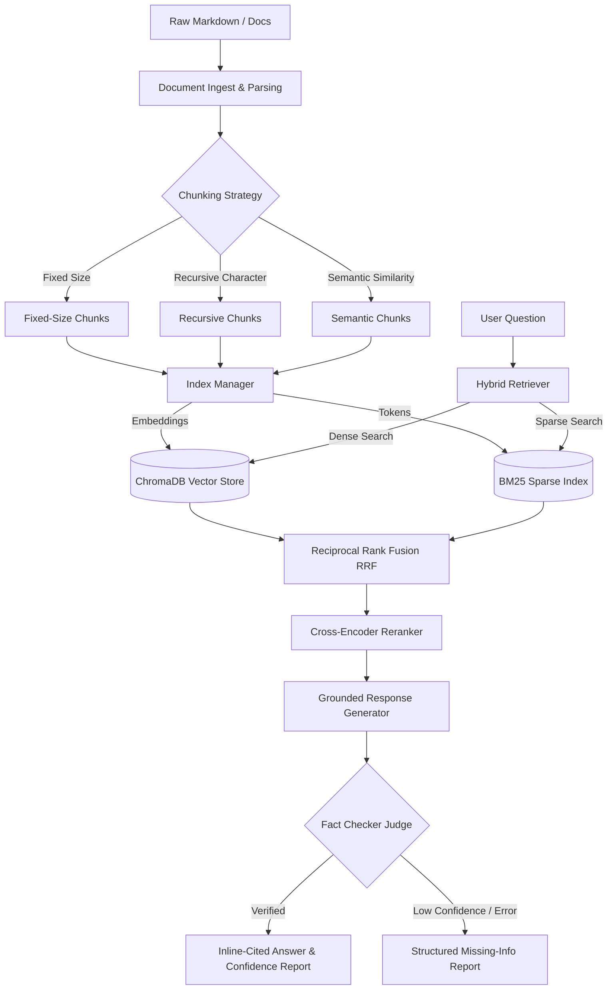

# Hybrid RAG Search Over Internal Docs

A production-grade, modular Retrieval-Augmented Generation (RAG) pipeline designed to index, query, and evaluate internal technical documentation. It leverages hybrid search, Reciprocal Rank Fusion (RRF), Cross-Encoder re-ranking, and citation-based verification to deliver high-quality, grounded answers.

> [!IMPORTANT]
> This pipeline supports custom OpenAI-compatible API proxies (such as `openagentic.id`) and handles offline execution modes smoothly with fallback deterministic dummy vectors for embeddings.

---

## 🏗️ Architecture



### Components Summary

* **Document Ingest & Chunker**: Loads raw Markdown files and splits them. Supports **Fixed-Size**, **Recursive Paragraph**, and **Semantic Chunker** (which detects topic boundaries via sentence-to-sentence cosine similarity).
* **Index Manager**: Synchronously indexes document chunks. Stores vector representations in **ChromaDB** and lexical indices in **Rank-BM25**.
* **Hybrid Retriever**: Retrieves candidates using:
  * **Dense Search**: Cosine similarity against ChromaDB vectors.
  * **Sparse Search**: Keyword lookup using BM25.
  * Combines results using **Reciprocal Rank Fusion (RRF)**.
* **Cross-Encoder Re-ranker**: Performs second-pass neural re-ranking using `ms-marco-MiniLM-L-6-v2` to score matching candidates (with Jaccard overlap fallback if offline).
* **Grounded Generator**: Uses OpenAI's chat completions API to generate concise answers strictly grounded in the retrieved context with bracketed citations (e.g. `[1]`). Also utilizes an LLM-as-judge loop to verify citations and calculate completeness scores.

---

## 🛠️ Tech Stack

* **Backend Framework**: Python 3.11+, [FastAPI](https://fastapi.tiangolo.com/), Pydantic v2 (Settings & BaseModels), Uvicorn.
* **Vector Store**: [ChromaDB](https://www.trychroma.com/) (HttpClient & PersistentClient SQLite modes).
* **Lexical Index**: `rank-bm25` (BM25Okapi).
* **Neural Reranking**: `sentence-transformers` (Cross-Encoder models).
* **Chunking & Text Splitting**: `langchain-text-splitters`.
* **Frontend UI**: [Vite](https://vite.dev/) + React + Vanilla CSS (Aesthetic glassmorphic UI) with Streamlit bridge page.
* **Containerization**: Docker & Docker Compose.

---

## 🚀 Getting Started

### 📋 Prerequisites

* **Python**: 3.11 or higher installed on your local machine.
* **Node.js & npm**: For running/building the Vite React frontend.
* **Docker & Docker Compose**: (Optional) For containerized execution.

### ⚙️ Configuration Setup

Create a `.env` file in the project root:
```bash
cp .env.example .env
```
Fill in the configuration parameters inside `.env`:
```env
OPENAI_API_KEY=sk-your-key-here
# Optional base URL for OpenAI-compatible API proxies (e.g., openagentic.id)
OPENAI_API_BASE=https://openagentic.id/api/v1
LLM_MODEL=gpt-4o
EMBEDDING_MODEL=text-embedding-3-small

CHROMA_HOST=localhost
CHROMA_PORT=8001
```

---

### 💻 Local Run Mode

Follow these steps to set up and run the application natively on your host machine:

#### 1. Setup & Install dependencies
Create a Python virtual environment and install all packages in editable mode:
```bash
make install
```

#### 2. Ingest and Seed the database
Parse raw markdown docs, chunk them, and seed the index stores:
```bash
make ingest
make seed
```

#### 3. Run the concurrent Dev Servers
Start the FastAPI server and the Vite React frontend simultaneously:
```bash
make run
```
* **Frontend UI**: Open `http://localhost:5173` in your browser.
* **FastAPI Docs**: Access the interactive OpenAPI docs at `http://localhost:8000/docs`.

#### 4. Run the Streamlit Dashboard (Optional)
If you prefer checking the Streamlit bridge page dashboard:
```bash
make run-dashboard
```
* Access the page at `http://localhost:8501`.

---

### 🐳 Docker Compose Run Mode

To build and spin up containerized services (including a managed ChromaDB instance, the FastAPI API Server, and the React Dashboard):

#### 1. Start all containers in the background
```bash
make docker-up
```
* This boots up the `chroma-db`, `rag-api-server`, and `rag-dashboard-app`.
* **API Ingestion Seeding**: Done automatically when the `rag-api-server` container finishes starting up.

#### 2. Monitor Container logs
```bash
make docker-logs
```

#### 3. Stop containers
```bash
make docker-down
```

---

## 🧪 Pipeline Tests & Evaluation

You can run individual pipeline commands to benchmark or debug retrieval steps locally:

* **Unit Tests**: Run the pytest suite using `make test`.
* **Dense search test**: Test vector DB retrieval using `make dense-search`.
* **Sparse search test**: Test lexical BM25 retrieval using `make sparse-search`.
* **RRF search test**: Run Reciprocal Rank Fusion scenarios using `make rrf-search`.
* **Rerank search test**: Perform neural Cross-Encoder re-ranking with `make rerank-search`.
* **Chunking Comparison**: Compare performance metrics (Correctness, Faithfulness, Retrieval Relevance, and Citation Accuracy) across fixed, recursive, and semantic strategies:
  ```bash
  make chunk
  ```