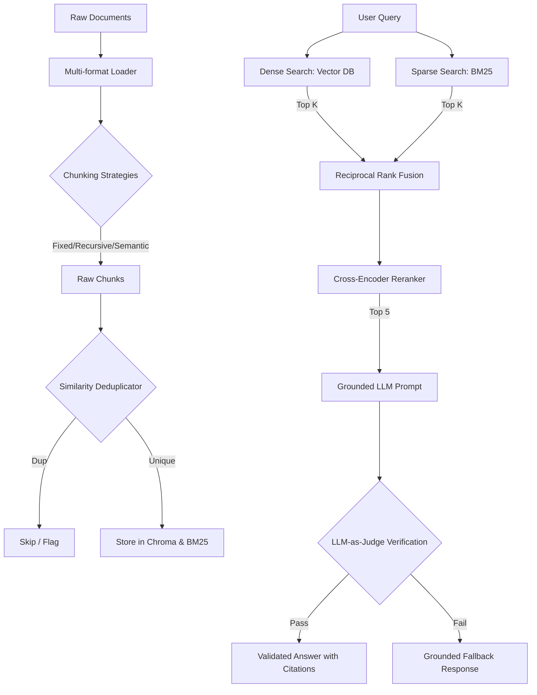

# Production-Grade RAG Pipeline: Complete Learning Path Guideline

Welcome to the **Hybrid RAG Pipeline** learning path. This guide transforms the concepts outlined in [RAG_Pipeline_Project.md](file:///Users/hafidz/Projects/rags-hybrid-search-over-docs/RAG_Pipeline_Project.md) into a step-by-step educational curriculum. 

Instead of treating RAG as a black-box library API call, you will construct the components from the ground up. This document explains the **what**, **why**, and **how** of each phase, detailing the mathematical and architectural decisions that separate a standard AI wrapper from a production-grade information retrieval system.

---

## Table of Contents
1. [Core Architecture Overview](#1-core-architecture-overview)
2. [Module 1: Ingestion, Structuring, and Deduplication](#module-1-ingestion-structuring-and-deduplication)
3. [Module 2: The Hybrid Retrieval Engine (Dense + Sparse + RRF)](#module-2-the-hybrid-retrieval-engine-dense--sparse--rrf)
4. [Module 3: Re-ranking (Cross-Encoders)](#module-3-re-ranking-cross-encoders)
5. [Module 4: Grounded Generation and Automated Citation Verification](#module-4-grounded-generation-and-automated-citation-verification)
6. [Module 5: The RAG Evaluation Suite (RAG Triad)](#module-5-the-rag-evaluation-suite-rag-triad)
7. [Module 6: Exposing API & Interactive Dashboard](#module-6-exposing-api--interactive-dashboard)

---

## 1. Core Architecture Overview

A naive RAG pipeline simply loads a PDF, splits it arbitrarily, vectorizes it, and sends the top-3 results to an LLM. In production, this fails due to:
* **Hallucinations:** The LLM makes up information because context is missing or noisy.
* **Loss in the Middle:** Long contexts cause LLMs to ignore information in the middle of prompts.
* **Keyword blindness:** Vector embeddings look for semantic themes but struggle with exact numbers, serial keys, or function names (e.g., looking for `getUser()` matches `fetchUser()` but might miss the exact syntax).

Our architecture addresses these using **Hybrid Retrieval**, **Re-ranking**, and **Verified Citation Grounding**.



---

## Module 1: Ingestion, Structuring, and Deduplication

### 1. Multi-Format Loading & Metadata Extraction
* **The Goal:** Load PDF, HTML, Markdown, and TXT files, converting them into structured text.
* **Why it matters:** Documents contain hierarchies (titles, subtitles, sections). If you strip this metadata, the context lose its grounding. A chunk containing table numbers is useless without the section title telling you *what* those numbers mean.
* **The Concept:** Extract text alongside a rich dictionary of metadata:
  ```python
  {
      "text": "The API endpoint is GET /v1/users...",
      "metadata": {
          "source": "api_docs.md",
          "heading": "User Registration",
          "page_number": 3,
          "content_type": "text/markdown"
      }
  }
  ```

### 2. The Three Chunking Strategies
You will implement and benchmark three switchable chunking methods:

| Strategy | How it works | Pros | Cons |
| :--- | :--- | :--- | :--- |
| **Fixed-Size (Baseline)** | Splits text strictly by characters or tokens (e.g. 500 characters, 50 character overlap). | Fast, simple. | Often cuts sentences in half, severing semantic context. |
| **Recursive Character** | Recursively splits on a list of characters (typically `\n\n`, `\n`, ` `, `""`) to keep paragraphs and sentences together. | Structure-aware. | Can still separate table rows or code blocks from descriptive text. |
| **Semantic Chunking** | Splits sentences based on embedding distance. Calculates the cosine distance between the embeddings of consecutive sentences, creating a split when the difference exceeds a threshold (e.g., 95th percentile of distances). | Keeps coherent topics together. | Computationally expensive; requires embed calls for every sentence. |

### 3. Vector Deduplication
* **The Concept:** Before adding chunks to the database, compute their embeddings and perform a cosine similarity check against existing chunks.
* **Math Refresher (Cosine Similarity):**
  $$\text{Similarity}(A, B) = \frac{A \cdot B}{\|A\| \|B\|}$$
* **Why it matters:** Company wikis often copy-paste the same config steps or installation instructions across multiple pages. If 3 duplicate chunks rank top in retrieval, you waste the LLM's context window on the same text.
* **Implementation Rule:** If $\text{Similarity} > 0.95$, skip insertion.

---

## Module 2: The Hybrid Retrieval Engine (Dense + Sparse + RRF)

Retrieval should combine the strengths of semantic search and keyword search.

### 1. Dense Retrieval (Semantic Search)
* **What it is:** Uses neural networks (like OpenAI's `text-embedding-3-small`) to convert texts into high-dimensional vectors (e.g., 1536 dimensions). Search matches queries by spatial closeness (cosine distance).
* **Strength:** Understands synonyms (e.g., "how to terminate a process" matches "kill task").

### 2. Sparse Retrieval (Keyword Search / BM25)
* **What it is:** Calculates the matching frequency of terms in a document compared to the document's length and frequency across the database.
* **Formula (BM25):** 
  $$Score(D, Q) = \sum_{i=1}^{n} IDF(q_i) \cdot \frac{f(q_i, D) \cdot (k_1 + 1)}{f(q_i, D) + k_1 \cdot \left(1 - b + b \cdot \frac{|D|}{\text{avgdl}}\right)}$$
  *(where $q_i$ is a query term, $f(q_i, D)$ is term frequency, $|D|$ is document length, $\text{avgdl}$ is average document length, and $k_1, b$ are tuning parameters)*
* **Strength:** Excellent at retrieving exact identifiers, names, API schemas, and error codes.

### 3. Reciprocal Rank Fusion (RRF)
How do you combine a vector similarity score (range 0 to 1) with a BM25 score (range 0 to $20+$)? You don't. You combine their *ranks*.

* **The Concept:** For a document $d$, RRF assigns a score based on its position in both dense and sparse retrieval result sets.
* **RRF Scoring Formula:**
  $$RRF\_Score(d \in D) = \sum_{m \in M} \frac{1}{k + r_m(d)}$$
  * $M$: The search strategies (Dense and Sparse).
  * $r_m(d)$: The rank index of document $d$ in strategy $m$ (1-based index).
  * $k$: A smoothing constant (commonly $60$) to prevent highly ranked items from completely dominating the score.

```python
# Conceptual RRF Implementation
def calculate_rrf(dense_ranks, sparse_ranks, k=60):
    rrf_scores = {}
    # dense_ranks: {doc_id: rank_position}
    for doc_id, rank in dense_ranks.items():
        rrf_scores[doc_id] = rrf_scores.get(doc_id, 0) + (1.0 / (k + rank))
    for doc_id, rank in sparse_ranks.items():
        rrf_scores[doc_id] = rrf_scores.get(doc_id, 0) + (1.0 / (k + rank))
    return sorted(rrf_scores.items(), key=lambda x: x[1], reverse=True)
```

---

## Module 3: Re-ranking (Cross-Encoders)

Retrieval from RRF gives us a candidate pool (e.g., top 20). Next, we refine it using a reranker.

```
       Bi-Encoder (Vector Embeddings)             Cross-Encoder (Reranker)
          [Query]         [Document]                    [Query + Document]
             │                │                                 │
             ▼                ▼                                 ▼
         [Encoder]        [Encoder]                        [Transformer]
             │                │                                 │
             ▼                ▼                                 ▼
          Vector           Vector                          [Similarity]
             └───────┬────────┘
                     ▼
             [Cosine Similarity]
```

### Bi-Encoders vs. Cross-Encoders
* **Bi-Encoders (Chroma Vector DB):** Generate embeddings for Query and Documents independently. Very fast (sub-millisecond) but cannot model interactions between specific query words and document sentences.
* **Cross-Encoders:** Pass the Query and Document *together* into a transformer. The attention mechanism models every word in the query against every word in the document.
* **Why it matters:** Extremely accurate, but slow. Thus, we use the Bi-Encoder/BM25 system to fetch 20 candidates, and the Cross-Encoder to sort and pick the top 5.

> [!TIP]
> You will use a lightweight local model such as `sentence-transformers/ms-marco-MiniLM-L-6-v2` as your Cross-Encoder. This model is fine-tuned specifically for passage ranking tasks.

---

## Module 4: Grounded Generation and Automated Citation Verification

Once the top-5 documents are selected, they are passed to the generation layer.

### 1. Grounding Prompts
The prompt must bind the LLM strictly to the context:
```markdown
You are an expert system. Answer the Query using only the context blocks provided below.
Rules:
1. Every claim you make MUST be directly supported by one of the context blocks.
2. Cite the context block using inline bracketed references containing the Block ID, e.g., [1] or [2, 3].
3. If the context does not contain the answer, say "I cannot answer this based on the provided documents."
```

### 2. Citation Verification (LLM-as-Judge)
Even with strict prompts, LLMs can hallucinate or map claims to the wrong sources. You will build an automatic validation agent:

1. **Claim Extraction:** Parse the generated answer to separate claims and their references.
2. **Entailment Audit:** Submit each claim-context pair to a prompt-based judge (using a small, fast model) to classify the relationship as:
   * **Entailed:** The claim is fully supported by the text.
   * **Contradicted:** The claim conflicts with the text.
   * **Neutral:** The claim contains external information not mentioned in the text.
3. **Action:** If a claim is flagged as Neutral or Contradicted, strip it from the output or lower the response confidence score.

---

## Module 5: The RAG Evaluation Suite (RAG Triad)

Evaluating RAG requires analyzing the retrieval stage separate from the generation stage. You will implement the **RAG Triad** framework:

```
                  ┌──────────────────────┐
                  │        Query         │
                  └──────────┬───────────┘
                 Query       │      Answer
               Relevance     │    Relevance
              (Retrieval)    ▼   (Generation)
                  ┌──────────────────────┐
                  │        Answer        │
                  └──────────┬───────────┘
                             │
                        Faithfulness
                        (Groundedness)
                             ▼
                  ┌──────────────────────┐
                  │       Context        │
                  └──────────────────────┘
```

1. **Context Relevance (Retrieval):** Are the retrieved chunks relevant to the user query?
   * *Metric:* Check if the query query intent aligns with context details via LLM classification.
2. **Faithfulness (Groundedness):** Is the answer derived *only* from the context?
   * *Metric:* Ratio of entails vs total claims.
3. **Answer Relevance:** Does the generated answer address the user query?
   * *Metric:* semantic similarity of the generated response compared to the original query goal.

### Building the Golden Dataset
To measure this, you will create a JSON dataset containing:
```json
[
  {
    "query": "What is the timeout limit for the v1/upload endpoint?",
    "golden_context": "The file upload service (/v1/upload) has a strict gateway timeout of 60 seconds...",
    "golden_answer": "The timeout limit for the upload endpoint is 60 seconds."
  }
]
```

---

## Module 6: Exposing API & Interactive Dashboard

To make the engine accessible, you will deploy a local stack:

* **FastAPI Service:** Handles document ingestion, background chunking/indexing, and query execution.
* **Streamlit Interface:** Provides a UI to ask questions, view RRF dense/sparse weights, toggle re-ranking, and inspect citations interactively.

---

## Complete Road Map Checklist

Here is your learning checklist to track your implementation progress:

* [x] **Setup:** Environment folders, `.gitignore`, `.env`, and dependencies setup.
* [ ] **Milestone 1:** Build document ingestion parsers & the fixed/recursive/semantic chunkers.
* [ ] **Milestone 2:** Set up ChromaDB and rank_bm25. Implement Reciprocal Rank Fusion (RRF).
* [ ] **Milestone 3:** Wire the Cross-Encoder reranker.
* [ ] **Milestone 4:** Build the generation pipeline & LLM-as-judge citation verification.
* [ ] **Milestone 5:** Create the golden dataset and run automated metrics.
* [ ] **Milestone 6:** Implement FastAPI and Streamlit dashboard.
